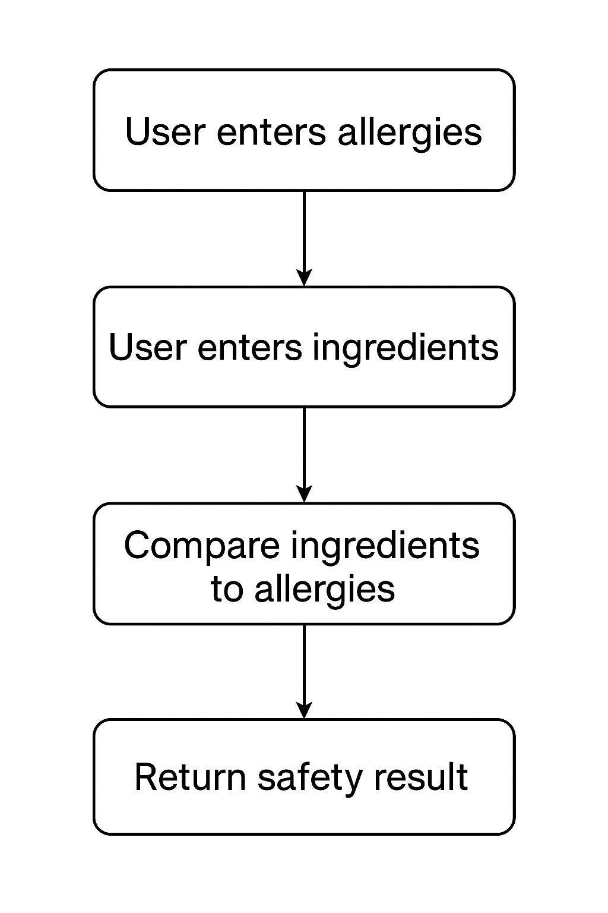

# Skincare Allergy Filter

## Project Overview
The **Skincare Allergy Filter** is a web application that helps users determine if skincare products are safe based on their personal allergies. Users can enter their allergies along with a product's ingredient list, and the app will check for potential allergens and return a safety recommendation.

---

## Features
- **Personal Allergy Input:** Users can list their known allergens.
- **Ingredient Check:** Users can input a skincare product’s ingredient list.
- **Safety Alert:** The app notifies whether the product is safe or contains allergens.

---

## How It Works
1. Users enter their personal allergies (e.g., nuts, parabens, fragrance).  
2. Users input the skincare product's ingredient list.  
3. The application compares the ingredient list against the user's allergies.  
4. The app returns a result:
   - **Safe:** No allergens detected.
   - **Unsafe:** Product contains one or more allergens.

---

## ⚙️ Project Workflow Diagram

Diagram flow of data through application


---

## Tech Stack
- **Framework:** Python Django (handles both frontend and backend)  
- **Database:** SQLite (default) or any Django-supported database  

---

## Installation
How to install and set up your project:

Note: Unless explicitly labeled, commands are shell-agnostic and work in Windows PowerShell, CMD, and Unix shells. Use the Windows-specific blocks where provided.

1. Clone the repository:
     - Windows (PowerShell):
         ```powershell
         git clone https://github.com/RJChoe/filter-project.git
         ```

     - macOS/Linux:
         ```bash
         git clone https://github.com/RJChoe/filter-project.git
         ```

2. Navigate to the project folder:
     - Windows (PowerShell):
         ```powershell
         cd filter-project
         ```

     - macOS/Linux:
         ```bash
         cd filter-project
         ```


(Remember to .gitignore .venv prior to setting up)

3. Create a virtual environment:
     - Windows (PowerShell):
         ```powershell
         python -m venv .venv
         ```

     - macOS/Linux:
         ```bash
         python -m venv .venv
         ```

4. Activate the virtual environment:
     - Windows (PowerShell):
         ```powershell
         .\.venv\Scripts\Activate
         ```

     - Windows (CMD):
         ```bat
         .\.venv\Scripts\activate.bat
         ```

     - macOS/Linux:
         ```bash
         source .venv/bin/activate
         ```

5. Install dependencies:
     - Windows (PowerShell):
         ```powershell
         pip install -r requirements.txt
         ```

     - macOS/Linux:
         ```bash
         pip install -r requirements.txt
         ```

6. Apply migrations:
     - Windows (PowerShell):
         ```powershell
         python manage.py makemigrations allergies user
         python manage.py migrate
         ```

     - macOS/Linux:
         ```bash
         python manage.py makemigrations allergies user
         python manage.py migrate
         ```

7. Run the development server:
     - Windows (PowerShell):
         ```powershell
         python manage.py runserver
         ```

     - macOS/Linux:
         ```bash
         python manage.py runserver
         ```

8. Open your browser and visit http://localhost:8000

---

## Verify Setup
Quick checks to confirm your environment:

 - Windows (PowerShell):
     ```powershell
     python -V
     python -c "import django; print(django.get_version())"
     ```

 - macOS/Linux:
     ```bash
     python -V
     python -c "import django; print(django.get_version())"
     ```

---

## Troubleshooting
Common setup issues and quick fixes:

- Activation policy error (PowerShell): If you see "running scripts is disabled on this system":
    ```powershell
    Set-ExecutionPolicy -Scope Process -ExecutionPolicy Bypass
    .\.venv\Scripts\Activate
    ```

- Python not found on Windows: Use the `py` launcher.
    ```powershell
    py -V
    py -m venv .venv
    py -m pip install -r requirements.txt
    ```

- Migrations/app errors: Ensure apps are installed and migrations ran.
    ```powershell
    python manage.py showmigrations
    python manage.py makemigrations allergies user
    python manage.py migrate
    ```

- Port already in use: Run on a different port.
    ```powershell
    python manage.py runserver 8001
    ```

---

## Usage
1. Enter your personal allergies.
2. Input the ingredients of a skincare product.
3. Click "Check Safety".
4. View the results indicating whether the product is safe.

---

## Screenshots/Demo

Here’s an example of how the app looks:
Allergy Input Page


Ingredients Input Page


Result Page


((Replace the above images with actual screenshots from your project in a screenshots/ folder.))

---

## Contact
    - Developer: Rebecca Jisoo Simpson

    - Email: RJSimpson1004@gmail.com

    - GitHub: RJChoe